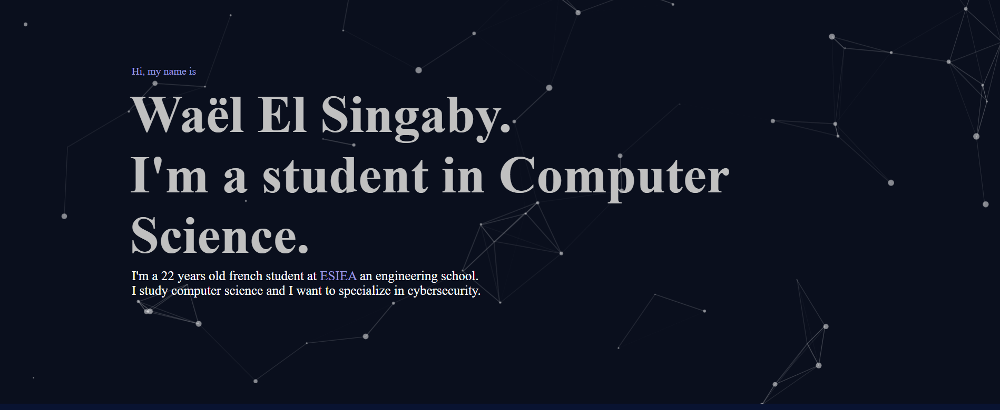

# Portfolio

 
 Portfolio-like website featuring some of my projects.

	

  

# How to access ?

You can find the website at the address : **[remilwael.com](https://remilrls.github.io/Portfolio/)**.

  
